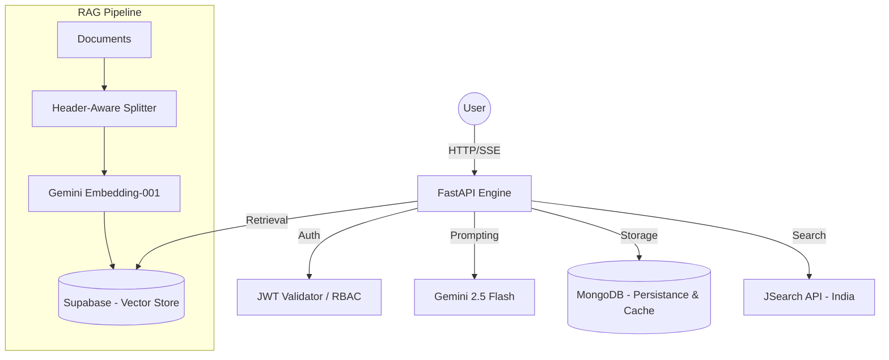

# ResumeAI 🧠 — Backend (v2.0)

The intelligent core of ResumeAI. This is a production-hardened **FastAPI** engine that orchestrates AI-driven resume tailoring, real-time RAG (Retrieval-Augmented Generation) chat, and automated job discovery.

---

## 🏗️ System Architecture & Design



---

## 🚀 Advanced Tech Stack

| Layer | Technology |
| :--- | :--- |
| **Engine** | [FastAPI](https://fastapi.tiangolo.com/) (Asynchronous Python 3.10+) |
| **Persistence** | **MongoDB** (Motor async driver) for User Data & Job Metadata |
| **Vector DB** | **Supabase (pgvector)** for high-speed semantic retrieval |
| **Reasoning** | **Google Gemini 2.5 Flash** (Specialized Agent Prompts) |
| **Search** | **JSearch API** with automated key rotation and date fallback |
| **Real-time** | **SSE (Server-Sent Events)** for async task streaming |
| **Observability** | Structured logging with `structlog` for request-id tracing |

---

## 🔥 Deep Dive: AI & Intelligence

### 🧬 Hierarchical AI Orchestration (Multi-Agent Workflow)
Instead of a generic LLM wrapper, ResumeAI uses a specialized multi-agent workflow:
1. **Extraction Agent**: Deep-parses raw text into structured JSON using strict schema validation.
2. **Tailoring Agent**: Maps candidate skills to JD requirements, performing gap analysis and match-scoring.
3. **Analytics Engine**: Generates ATS-simulated scores and keyword-match percentages.
4. **Summary Agent**: Dynamically generates context-aware labels for the user dashboard.

### 💬 RAG (Retrieval-Augmented Generation)
Our RAG implementation is built for precision:
- **Header-Aware Splitting**: Documents are split not just by length, but by semantic sections (e.g., Experience vs. Education).
- **Native RPC Retrieval**: Bypasses Langchain overhead for direct Supabase RPC calls, optimizing for latency.
- **Strict Grounding**: Prompt strategy forces the model to cite only retrieved context, minimizing hallucination.

### 💼 Intelligent Job Recommendation Logic
The system implements a multi-stage recommendation pipeline:
1. **Profile Classification**: Analyzes historical user behavior to categorize into `Fresher-Tech`, `Experienced-Tech`, or `Non-Tech`.
2. **Dynamic Query Builder**: Generates optimized search queries to maximize JSearch relevancy.
3. **Multi-Level Caching**: Job listings and full descriptions are cached in MongoDB for 24h to minimize API costs and latency.
4. **Key Rotation**: Built-in redundancy for JSearch API keys with automatic failover and date-posted expansion (Today → 3 Days → 1 Week).

---

## 🛡️ Performance & Security

- **Rate Limiting**: Implemented via `SlowAPI` with fine-grained control for AI vs. Auth endpoints.
- **Sanitization Engine**: Custom recursive bleach-based sanitizers for all AI-generated content to prevent XSS-injection.
- **JWT Middleware**: Strict authentication with security headers (`HSTS`, `X-Content-Type-Options`).
- **Async Efficiency**: Entirely non-blocking I/O using `httpx` and `motor`.

---

## 🛠️ Project Structure

```text
backend/
├── app/
│   ├── main.py             # Entry point: Middleware, Cors, Routing
│   ├── config.py           # Pydantic-Settings (Environment-driven)
│   ├── routers/            # Domain-driven boundaries (auth, resume, chat, jobs)
│   ├── services/           # Business Logic (AI Logic, Job Fetching, PDF Orchestration)
│   ├── models/             # Strict Pydantic Data Models (Type-safety)
│   └── prompts/            # Engineered system prompts for deterministic AI behavior
├── rag_pipeline/           # Standalone Python suite for Vector DB population
└── requirements.txt        
```

---

## ⚡ Setup & Deployment

### 1. Prerequisites
- Python 3.10+
- MongoDB & Supabase
- Google Gemini API Key

### 2. Environment (Copy .env.example)
```env
GEMINI_API_KEY=...
MONGO_URI=...
SUPABASE_URL=...
SUPABASE_KEY=...
JSEARCH_API_KEYS=["key1", "key2"]
```

### 3. Quick Start
```bash
pip install -r requirements.txt
uvicorn app.main:app --reload --port 8000
```

---
*Created with ❤️ by the ResumeAI Team.*
